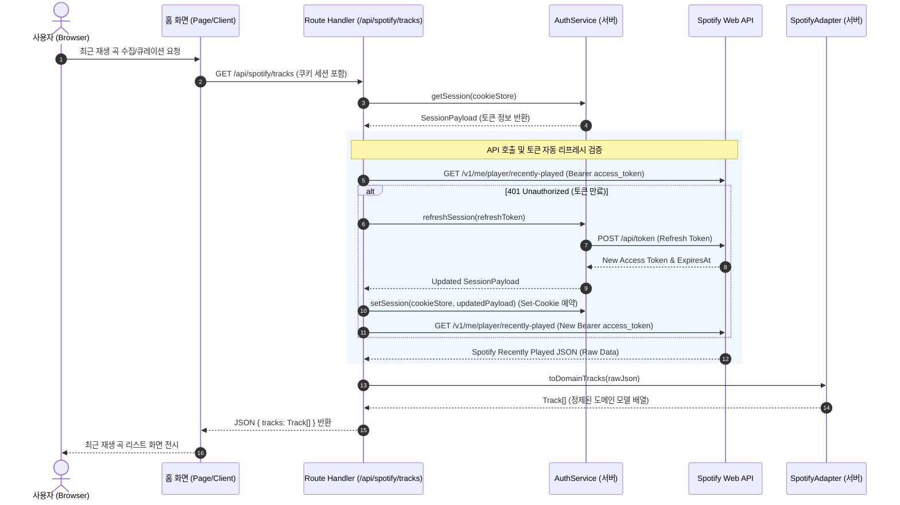

# U-003 비즈니스 로직 모델 (Business Logic Model)

<!-- markdownlint-disable MD013 -->

## 최근 재생 곡 조회 및 도메인 정제 흐름

최근 재생 곡 연동 기능은 사용자의 최근 음악 취향(트랙 정보)을 Spotify Web API로부터 수집하여 핵심 도메인 개체로 변환하고, 이를 플레이리스트 큐레이션 엔진(LLM)에 전달하기 위한 입력 데이터를 형성하는 흐름을 가집니다.

## 컴포넌트별 명세 및 책임

### 1. Spotify API Client / Service (`src/server/services/spotify-service.ts`)

- **책임**: Spotify API와의 HTTP 통신을 전담하며, 원시 JSON 데이터를 받아옵니다.
- **수행 작업**:
  - `getRecentlyPlayedTracks(accessToken: string, limit: number): Promise<RawSpotifyPlayHistory[]>`
  - API 호출 중 HTTP 401 오류 감지 시 적절한 예외 코드를 던져 상위 핸들러가 토큰을 갱신하도록 지원합니다.

### 2. Spotify Data Adapter (`src/server/adapters/spotify-adapter.ts` 또는 `src/server/services/spotify-service.ts` 내부)

- **책임**: Spotify Web API의 복잡한 JSON 결과를 간소화된 애플리케이션 코어 도메인 엔티티인 `Track`과 `Artist`로 안전하게 변환합니다.
- **수행 작업**:
  - 사용자 결정 사양(Question 1 - Option C)에 따라 **플레이리스트 생성에 필요한 트랙 URI와 제목/아티스트 텍스트만 단순 추출**합니다.
  - 중복 곡 배제: 최근에 짧은 간격으로 여러 번 들은 동일 트랙은 중복 제거하여 하나의 고유 트랙으로 변환합니다.

### 3. API Route Handler (`app/api/spotify/tracks/route.ts`)

- **책임**: 요청을 받아 쿠키 세션을 복원하고, 토큰 만료 여부를 판별하여 자동으로 리프레시를 제어한 후, 정제된 트랙 도메인 데이터를 반환합니다.
- **수행 작업**:
  - `cookies()`로부터 서명된 쿠키 세션을 파싱합니다.
  - 세션 만료 시간(`expiresAt`)을 사전에 체크하거나, 401 에러 감지 시 `AuthService.refreshSession`을 트리거하여 Access Token을 자동으로 재발급하고 쿠키를 갱신합니다.
