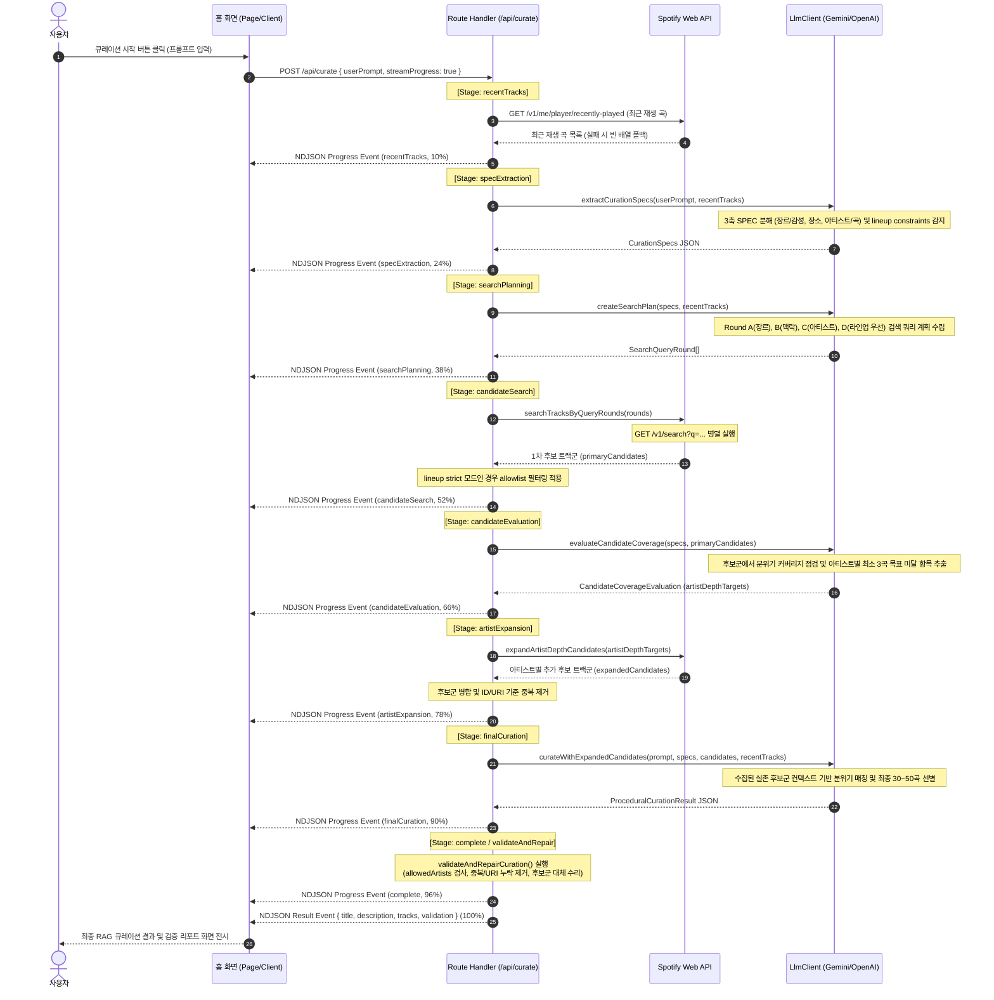

# U-004 비즈니스 로직 모델 (Business Logic Model)

<!-- markdownlint-disable MD013 -->

## RAG 기반 절차형 음악 큐레이션 로직 흐름

사용자가 입력한 자연어 분위기 프롬프트와 최근 재생 곡 목록을 바탕으로, LLM과 Spotify Search API를 다단계로 연동하는 RAG(Retrieval-Augmented Generation) 파이프라인을 실행합니다. 또한, 대기 시간 동안 클라이언트에 NDJSON 스트림 형태로 작업의 진행 상태를 실시간 보고합니다.

## 컴포넌트별 명세 및 책임

### 1. Curation Route Handler (`app/api/curate/route.ts`)

- **책임**: 클라이언트의 POST 요청을 접수하고, 세션 유효성을 확인하며, 전체 RAG 절차형 파이프라인(`runProceduralCuration`)을 구동하고 NDJSON progress stream 또는 단일 JSON 응답을 반환합니다.
- **수행 작업**:
  - `POST(request: Request)`: API Key 검증, 스트리밍 헤더 설정, 파이프라인 예외 발생 시 최근 곡 폴백 처리 (`createFallbackResult`).
  - `validateAndRepairCuration(curation, specs, candidates)`: 최종 LLM 선별 결과를 바탕으로 하드 제약(allowedArtists 위반, 중복, Spotify URI 부재)을 규칙 기반으로 즉시 검증하고 수리(repair)합니다.

### 2. LlmClient (`src/server/services/llm-client.ts`)

- **책임**: 외부 LLM API와의 연동을 전담하고, 3축 SPEC 분해, 검색 계획 수립, 후보군 검출 커버리지 분석, 후보군 바인딩 기반 최종 선별 큐레이션을 수행합니다.
- **수행 작업**:
  - `extractCurationSpecs(userPrompt, recentTracks)`: 자연어 프롬프트를 분해하고, 페스티벌 정보 포함 시 strict lineup constraints로 승격시킵니다.
  - `createSearchPlan(specs, recentTracks)`: 각 SPEC과 최근 곡을 조합해 Spotify Search API용 다중 쿼리 라운드 계획을 설계합니다.
  - `evaluateCandidateCoverage(specs, candidates)`: 1차 후보군을 대조하여 SPEC의 분위기가 충분히 커버되는지 확인하고, 아티스트별 최소 3곡 목표를 채우기 위한 타겟 아티스트 목록을 추출합니다.
  - `curateWithExpandedCandidates(userPrompt, specs, candidates, recentTracks)`: 수집된 전체 후보 트랙들만 컨텍스트로 제공하여 환각 없는 최종 큐레이션 결과물을 생성합니다.

### 3. Prompt Builder (LlmClient 내부)

- **책임**: 3축 SPEC 분해, 검색계획 수립, 커버리지 평가, 최종 큐레이션 단계별로 LLM의 구조화 JSON 응답을 보장하도록 시스템 프롬프트와 DTO 기반 구조화 템플릿을 조립합니다.
- **수행 작업**:
  - Gemini의 `responseMimeType: "application/json"` 또는 OpenAI의 `response_format: { type: "json_object" }`를 설정하여 파싱 안정성을 확보합니다.
