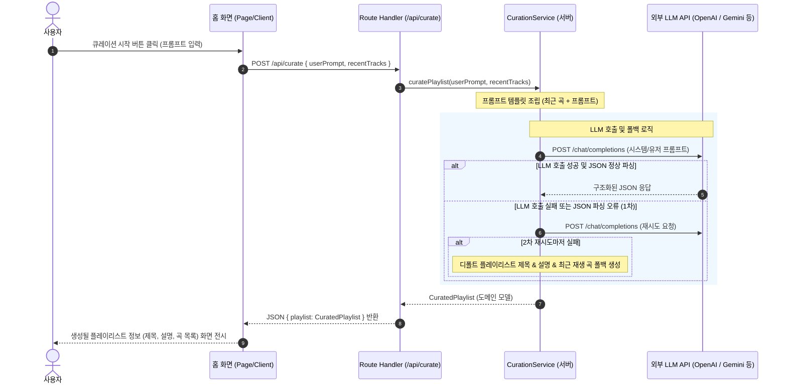

# U-004 비즈니스 로직 모델 (Business Logic Model)

<!-- markdownlint-disable MD013 -->

## AI 플레이리스트 큐레이션 로직 흐름

사용자가 입력한 자연어 분위기 프롬프트와 정제된 최근 재생 곡 목록을 바탕으로 프롬프트를 구성하여 LLM API를 호출하고, 반환된 응답 구조를 파싱하여 플레이리스트 정보와 추천 트랙 리스트를 도메인 모델로 확보하는 흐름을 정의합니다.

## 컴포넌트별 명세 및 책임

### 1. Curation Service (`src/server/services/curation-service.ts`)

- **책임**: 프롬프트를 결합 및 조립하고, 외부 LLM API와의 연동을 대행하며, 응답 결과를 구조화된 JSON 도메인 객체로 추출하고 폴백 처리를 보증합니다.
- **수행 작업**:
  - `curatePlaylist(userPrompt: string, recentTracks: Track[]): Promise<CuratedPlaylist>`
  - `LLM_API_KEY` 환경 변수가 누락된 경우, 비즈니스가 멈추지 않도록 정해진 규격의 모의(Mock) LLM 응답을 자동 생성하여 반환합니다 (Option A - 환경 변수 연동 Mock 지원).

### 2. Prompt Builder (`src/server/services/prompt-builder.ts` 또는 CurationService 내부)

- **책임**: 사용자 프롬프트와 최근 재생 곡 데이터를 바탕으로 지시 사항(JSON Schema 출력 강제 등)이 포함된 최적의 LLM 시스템/유저 메시지 구조를 빌드합니다.
- **수행 작업**:
  - `buildPrompt(userPrompt: string, recentTracks: Track[]): string`
  - 최근 재생 트랙이 비어 있는 경우(Option C 규칙) 이를 감지하고, 최근 곡 반영 조건 부분을 생략한 일반 큐레이션용 최적화 프롬프트를 구성합니다.
