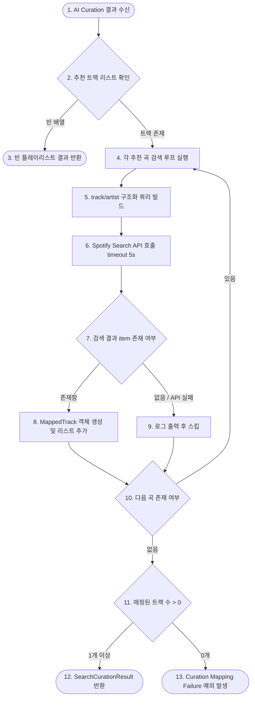

# U-005 비즈니스 로직 모델 (Business Logic Model)

<!-- markdownlint-disable MD013 -->

본 문서는 U-005 Spotify Search API 연동 및 트랙 매핑의 실행 흐름과 매핑 비즈니스 로직 시나리오를 기술합니다.

## 1. 비즈니스 로직 흐름

텍스트 기반 큐레이션 결과(`CuratedPlaylist`)가 수신되면, 백엔드는 각 트랙 텍스트 정보에 부합하는 Spotify 고유 URI를 수집합니다.

---

## 2. 세부 처리 단계 설명

### Step 1: 입력 검증 및 쿼리 빌딩

- AI 큐레이션이 반환한 `CuratedPlaylist`의 각 트랙 객체(`CuratedTrack`)로부터 `title`과 `artistName`을 추출합니다.
- 특수문자 및 공백 이스케이프 처리를 완료한 후 Spotify Search API의 구조화된 쿼리 파라미터를 작성합니다.
  - `q=track:"{title}" artist:"{artistName}"`
  - `type=track`
  - `limit=1`

### Step 2: Spotify Web API 비동기 조회

- 획득한 Spotify Access Token을 Bearer 헤더에 얹고 API를 호출합니다.
- 네트워크 무기한 블로킹을 차단하기 위해 **최대 5초**의 AbortController 기반 타임아웃을 적용합니다.
- 개별 트랙 검색 과정에서 오류가 발생한 경우 예외를 삼키고(Catch) 경고 로깅을 남긴 뒤 스킵 단계로 전이합니다.

### Step 3: 데이터 변환 및 매핑

- API 응답 바디에서 `tracks.items` 배열을 확인하여 첫 번째 엘리먼트(`items[0]`)를 검출합니다.
- 검출된 raw 데이터를 도메인 엔티티인 `MappedTrack` 규격에 부합하도록 매핑합니다:
  - `id` <- `items[0].id`
  - `uri` <- `items[0].uri`
  - `title` <- `items[0].name`
  - `artistName` <- `items[0].artists[0].name`

### Step 4: 결과 수집 및 에러 전파

- 최종 매핑에 성공한 `MappedTrack` 리스트를 모아 `SearchCurationResult`를 작성합니다.
- 만약 AI가 추천한 트랙 전체를 검색했으나 단 하나의 트랙도 실제 Spotify URI로 매핑하는 데 성공하지 못한 경우, 플레이리스트 생성 단계로 넘어가지 않고 즉시 예외를 발생시킵니다.
