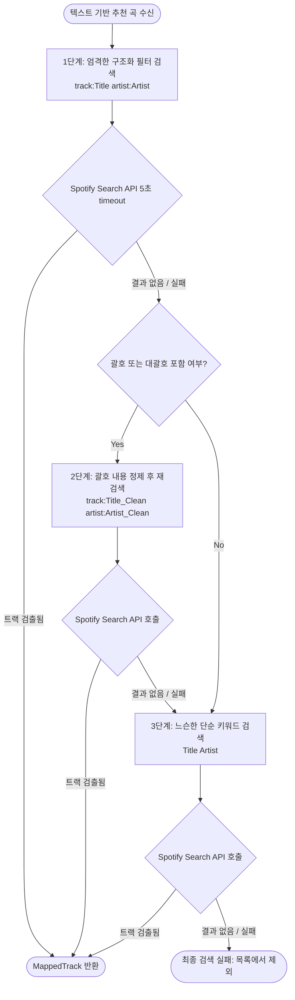

# U-005 비즈니스 로직 모델 (Business Logic Model)

<!-- markdownlint-disable MD013 -->

본 문서는 U-005 Spotify Search API 연동 및 트랙 매핑의 실행 흐름과 예외 처리 시나리오를 기술합니다.

## 1. RAG 다중 라운드 검색 및 아티스트 깊이 확장 흐름

RAG 파이프라인에서 수립된 검색 계획(`SearchQueryRound[]`)을 바탕으로 다중 쿼리를 병렬로 검색하고, 1차 후보군 수집 후 부족한 아티스트의 곡을 채워 최종 후보 트랙군을 생성하는 흐름입니다.

```mermaid
graph TD
    Start([1. RAG Search 계획 수신]) --> CheckMock{2. MOCK_SPOTIFY 모드인가?}
    CheckMock -- Yes --> MockSearch[3. 쿼리 키워드 기반 가짜 트랙 자동 생성] --> Deduplicate[8. 트랙 ID/URI 기준 중복 제거]
    CheckMock -- No --> CheckSession{4. 유효 세션 존재 여부}
    CheckSession -- No --> ThrowError[5. Session 부재 에러 발생]
    CheckSession -- Yes --> ParallelSearch[6. 다중 쿼리 및 오프셋 병렬 API 호출 실행]
    ParallelSearch --> CallWithToken{7. HTTP GET /v1/search 호출}
    CallWithToken -- 401 Unauthorized --> TokenRefresh[9. Access Token 갱신 시도]
    TokenRefresh -- 성공 --> RetrySearch[10. 새 토큰으로 API 1회 재호청] --> MergeResults[11. 1차 후보군 수집 완료]
    TokenRefresh -- 실패 --> ClearSession[12. 세션 강제 만료 및 에러 반환]
    CallWithToken -- 200 OK --> MergeResults
    CallWithToken -- 기타 에러/타임아웃 --> SkipQuery[13. 로그 출력 후 해당 쿼리 스킵] --> MergeResults
    MergeResults --> Deduplicate
    Deduplicate --> CoverageCheck{14. 아티스트별 최소 3곡 검사}
    CoverageCheck -- 부족한 아티스트 존재 --> ArtistExpansion[15. artist:쿼리로 추가 깊이 검색 실행]
    ArtistExpansion --> MergeResults2[16. 2차 후보군 병합 및 최종 중복 제거]
    CoverageCheck -- 충분함 --> ReturnCandidates([17. 최종 후보군 MappedTrack[] 반환])
    MergeResults2 --> ReturnCandidates
```

---

## 2. 개별 트랙 3단계 정밀 매핑 흐름 (Fallback & Match)

RAG를 사용하지 않는 단일 곡 단위 정밀 검색 시, 또는 개별 텍스트 트랙 정보를 스포티파이 실존 URI와 1:1 매핑할 때 적용되는 3단계 Fallback 구조입니다.



---

## 3. 세부 처리 단계 설명

### Step 1: 쿼리 병렬 처리 및 AbortController 타임아웃

- Spotify Search API를 다중 호출하는 과정에서 발생하는 지연을 최소화하기 위해 `Promise.all` 기반의 비동기 병렬 처리를 수행합니다.
- 각 호출에는 **최대 5초**의 AbortController 기반 타임아웃이 적용되며, 타임아웃 발생 시 해당 개별 요청은 에러를 전파하지 않고 격리된 상태로 스킵됩니다.

### Step 2: 401 Unauthorized 에러 감지와 자동 복원

- API 요청 도중 Spotify Access Token이 만료되어 `401` 상태 코드가 수신되는 즉시, 상위 호출 흐름으로 예외를 전파하지 않고 내부 토큰 리프레시 로직(`authService.refreshSession`)을 수행합니다.
- 새로 발급받은 Access Token을 이용해 동일 요청을 1회 재시도함으로써 사용자 경험의 중단을 차단합니다.

### Step 3: MappedTrack 데이터 정규화 및 중복 제거

- Spotify Search API 응답에서 트랙의 ID, URI, 제목, 첫 번째 아티스트 이름을 추출하여 `MappedTrack` 도메인 객체로 변환합니다.
- 다중 쿼리 실행 결과 동일한 곡이 여러 번 검색되는 경우가 매우 빈번하므로, 최종 수집 배열을 `id` 또는 `uri` 문자열을 기준으로 고유값 중복 제거(`deduplicateMappedTracks`)합니다.
