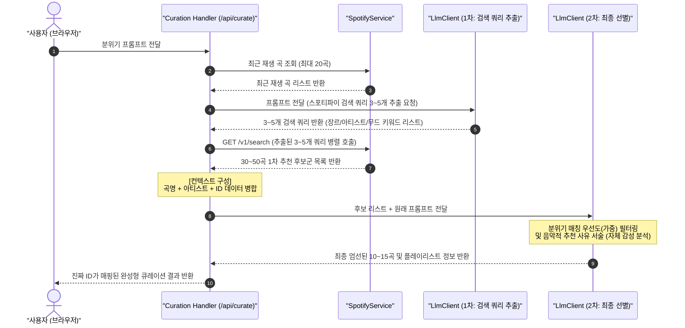

# RAG 기반 음악 큐레이션 아키텍처 설계서

<!-- markdownlint-disable MD013 -->

## 1. 아키텍처 개요

본 설계서는 사용자의 감정 프롬프트와 음악 취향을 스포티파이 Recommendations
API 및 Audio Features API의 실제 카탈로그 정보와 융합하고, 2단계 LLM
파이프라인을 통해 정밀 필터링하는 **RAG(Retrieval-Augmented Generation) 기반
음악 추천 모델**의 물리적/논리적 아키텍처를 정의합니다.

---

## 2. 컴포넌트 역할 및 설계 구조

```text
┌────────────────────────────────────────────────────────────────────────┐
│                              Next.js App                               │
│                                                                        │
│  ┌──────────────────────┐      요청      ┌──────────────────────────┐  │
│  │   Curation Handler   │ ─────────────> │        LlmClient         │  │
│  │   (/api/curate)      │ <───────────── │        (서비스)          │  │
│  └──────────────────────┘     큐레이션   └──────────────────────────┘  │
│             │                                          │               │
│             │ (이력 조회 / 후보 검색)                  │               │
│             ▼                                          ▼               │
│  ┌──────────────────────┐                     ┌─────────────────────┐  │
│  │    SpotifyService    │                     │    1차 LLM (시드)   │  │
│  │    (Spotify API)     │                     │    2차 LLM (최종)   │  │
│  └──────────────────────┘                     └─────────────────────┘  │
└─────────────│──────────────────────────────────────────│───────────────┘
              │                                          │
              ▼ (REST API)                               ▼ (Gemini/OpenAI)
   ┌──────────────────────┐                     ┌─────────────────────┐
   │     Spotify API      │                     │     LLM API 키      │
   └──────────────────────┘                     └─────────────────────┘
```

* **Curation Handler (`/api/curate` Route Handler)**:
  전체 오케스트레이션 역할을 담당합니다. 클라이언트의 분위기 입력을 받고,
  `SpotifyService`와 `LlmClient`를 조율하여 데이터 흐름을 제어합니다.
* **SpotifyService (백엔드 서비스)**:
  최근 재생 곡 수집, 1차 검색 쿼리 기반 Search API 병렬 조회 및 데이터 매핑을 담당합니다.
* **LlmClient (AI 서비스)**:
  * **1차 프롬프트 (검색 쿼리 추출기)**: 자연어 프롬프트에서 스포티파이 검색 쿼리 3~5개를 도출합니다.
  * **2차 프롬프트 (최종 큐레이터)**: 실존 1차 후보군 텍스트 정보를 혼합해 감성을 분석하고, 최종 10~15곡을 엄선합니다.

---

## 3. 데이터 흐름 및 시퀀스 다이어그램 (Sequence Diagram)



---

## 4. 상세 인터페이스 계약 (Interface Contracts)

### 4.1 1차 LLM 검색어 추출 프롬프트 및 응답 스키마

* **System Prompt**:
  "자연어 프롬프트를 분석하여 Spotify Search API에 전달할
  검색어 쿼리(searchQueries)를 도출하라. 최대 5개로 제한하며, 장르 필터(예: genre:lo-fi)나 대표 아티스트 키워드 형태로 반환해야 한다."

* **Response JSON Schema**:

  ```json
  {
    "searchQueries": ["genre:chill", "lo-fi", "Jeremy Zucker"]
  }
  ```

### 4.2 2차 최종 LLM 컨텍스트 데이터 구조

* LLM에 전달할 컨텍스트(`recommendedTracks` 후보군):

  ```json
  [
    {
      "id": "5HCyWkgU61j21yUjVmw2aV",
      "title": "Stay",
      "artistName": "The Kid LAROI, Justin Bieber"
    }
  ]
  ```

### 4.3 예외 상황(Search API 실패)에 대한 폴백 계약

* 5번 단계(Search API) 호출 중 네트워크 에러 또는 데이터 없음이 발생할 경우, Handler는 즉시 2단계에서 받은
  **최근 재생 곡 목록(`recentTracks`)**을 최종 큐레이션 결과 데이터 구조에
  그대로 래핑하여 200 OK로 폴백 반환한다.
