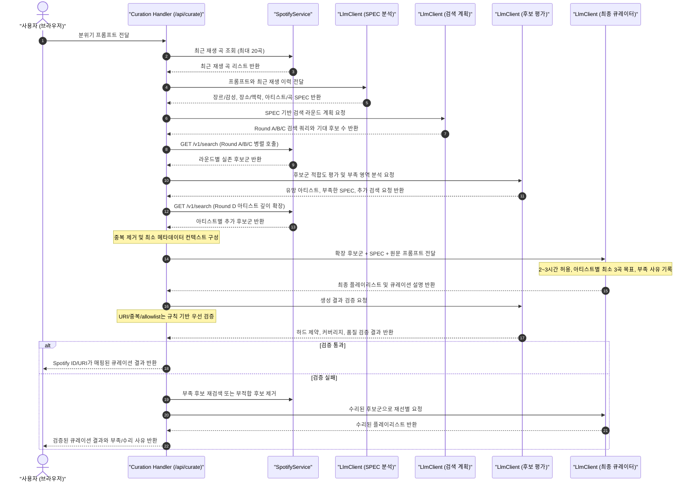

# RAG 기반 음악 큐레이션 아키텍처 설계서

<!-- markdownlint-disable MD013 -->

## 1. 아키텍처 개요

본 설계서는 사용자의 감정 프롬프트와 음악 취향을 구조화된 SPEC으로 분해하고,
Spotify Search API로 실제 카탈로그 후보를 넓게 확보한 뒤, 내부 멀티턴 LLM
파이프라인으로 긴 플레이리스트를 구성하는 **절차형 RAG(Retrieval-Augmented
Generation) 기반 음악 추천 모델**의 물리적/논리적 아키텍처를 정의합니다.

`Recommendations` 및 `Audio Features` API가 Deprecated 및 신규/개발 모드 앱
접근 제한 대상이므로, 본 설계의 기본 Retrieval 경로는 Spotify Search API입니다.

---

## 2. 컴포넌트 역할 및 설계 구조

```text
┌────────────────────────────────────────────────────────────────────────┐
│                              Next.js App                               │
│                                                                        │
│  ┌──────────────────────┐      요청      ┌──────────────────────────┐  │
│  │   Curation Handler   │ ─────────────> │        LlmClient         │  │
│  │   (/api/curate)      │ <───────────── │        (서비스)          │  │
│  └──────────────────────┘     큐레이션   └──────────────────────────┘  │
│             │                                          │               │
│             │ (이력 조회 / 후보 검색)                  │               │
│             ▼                                          ▼               │
│  ┌──────────────────────┐                     ┌─────────────────────┐  │
│  │    SpotifyService    │                     │    1차 LLM (시드)   │  │
│  │    (Spotify API)     │                     │    2차 LLM (최종)   │  │
│  └──────────────────────┘                     └─────────────────────┘  │
└─────────────│──────────────────────────────────────────│───────────────┘
              │                                          │
              ▼ (REST API)                               ▼ (Gemini/OpenAI)
   ┌──────────────────────┐                     ┌─────────────────────┐
   │     Spotify API      │                     │     LLM API 키      │
   └──────────────────────┘                     └─────────────────────┘
```

* **Curation Handler (`/api/curate` Route Handler)**:
  전체 오케스트레이션 역할을 담당합니다. 클라이언트의 분위기 입력을 받고,
  `SpotifyService`와 `LlmClient`를 조율하여 데이터 흐름을 제어합니다.
* **SpotifyService (백엔드 서비스)**:
  최근 재생 곡 수집, 1차 검색 쿼리 기반 Search API 병렬 조회 및 데이터 매핑을 담당합니다.
* **LlmClient (AI 서비스)**:
  * **Step 1 - SPEC 분석기**: 자연어 프롬프트를 장르/감성 SPEC, 장소/청취 맥락 SPEC, 아티스트/곡 SPEC으로 분해합니다.
  * **Step 2 - 검색 계획 생성기**: SPEC별 검색 라운드와 Spotify Search API 쿼리 목록을 생성합니다.
  * **Step 3 - 후보 평가기**: 검색된 실존 후보군에 감성/장소/아티스트 적합도와 부족한 영역을 표시합니다.
  * **Step 4 - 아티스트 깊이 확장기**: 최종 후보에 포함될 가능성이 높은 아티스트마다 최소 3곡 확보를 목표로 추가 검색을 요청합니다.
  * **Step 5 - 최종 큐레이터**: 확장된 후보군을 바탕으로 2~3시간까지 허용되는 긴 플레이리스트를 구성하고, 부족 사유와 큐레이션 설명을 생성합니다.
  * **Step 6 - 검증기**: 생성된 결과가 Spotify URI, 중복 제거, allowlist,
    아티스트 depth, 프롬프트 품질 기준을 만족하는지 검사합니다.
  * **Step 7 - 수리기**: 검증 실패 시 부적합 트랙 제거, 후보 재검색,
    재선별을 제한된 횟수로 수행하고 최종 실패 사유를 남깁니다.

---

## 3. 데이터 흐름 및 시퀀스 다이어그램 (Sequence Diagram)



---

## 4. 상세 인터페이스 계약 (Interface Contracts)

### 4.1 SPEC 분석 응답 스키마

* **System Prompt**:
  "사용자의 자연어 프롬프트를 장르/감성, 장소/청취 맥락, 아티스트/곡
  SPEC으로 분해하라. 명시된 정보와 추론한 정보를 구분하고, 각 SPEC의
  confidence와 mustHave/niceToHave/avoid 조건을 반환하라."

* **Response JSON Schema**:

  ```json
  {
    "genreMoodSpec": {
      "mustHave": ["city pop", "bright", "night drive"],
      "niceToHave": ["80s synth", "medium tempo"],
      "avoid": ["heavy metal"],
      "confidence": 0.82
    },
    "placeContextSpec": {
      "mustHave": ["late-night driving"],
      "niceToHave": ["not too sleepy"],
      "avoid": [],
      "confidence": 0.76
    },
    "artistTitleSpec": {
      "artists": ["YUKIKA"],
      "similarArtists": ["Mariya Takeuchi"],
      "titles": [],
      "avoid": [],
      "confidence": 0.68
    }
  }
  ```

### 4.2 검색 계획 응답 스키마

* **System Prompt**:
  "SPEC을 바탕으로 Spotify Search API 후보군을 수집하기 위한 내부
  멀티턴 검색 라운드를 설계하라. 장르/감성, 장소/맥락, 아티스트/곡
  라운드를 분리하고, 아티스트 깊이 확장 라운드는 후보 평가 후 실행할
  수 있도록 별도 단계로 남겨라."

* **Response JSON Schema**:

  ```json
  {
    "rounds": [
      {
        "round": "genreMood",
        "queries": ["city pop night drive", "genre:pop synth night"],
        "limitPerQuery": 10
      },
      {
        "round": "placeContext",
        "queries": ["late night drive pop", "urban night cruising"],
        "limitPerQuery": 10
      },
      {
        "round": "artistTitle",
        "queries": ["artist:YUKIKA", "Mariya Takeuchi city pop"],
        "limitPerQuery": 10
      }
    ]
  }
  ```

### 4.3 최종 LLM 컨텍스트 데이터 구조

* LLM에 전달할 컨텍스트(`recommendedTracks` 후보군):

  ```json
  [
    {
      "id": "5HCyWkgU61j21yUjVmw2aV",
      "title": "Stay",
      "artistName": "The Kid LAROI, Justin Bieber",
      "uri": "spotify:track:5HCyWkgU61j21yUjVmw2aV",
      "sourceRound": "artistTitle"
    }
  ]
  ```

### 4.4 최종 큐레이션 응답 스키마

* **System Prompt**:
  "원문 프롬프트, SPEC, 후보군을 기준으로 최종 플레이리스트를 구성하라.
  2~3시간 길이를 허용하며, 가능한 경우 같은 아티스트는 최소 3곡을
  포함하라. Spotify 후보가 부족한 아티스트는 가능한 곡만 포함하고
  부족 사유를 남겨라."

* **Response JSON Schema**:

  ```json
  {
    "playlistTitle": "Midnight City Drive",
    "playlistDescription": "도시의 밤 드라이브에 맞춘 밝고 세련된 신스팝 중심 큐레이션입니다.",
    "targetDurationMinutes": 150,
    "tracks": [
      {
        "id": "5HCyWkgU61j21yUjVmw2aV",
        "uri": "spotify:track:5HCyWkgU61j21yUjVmw2aV",
        "title": "Stay",
        "artistName": "The Kid LAROI, Justin Bieber",
        "reason": "밝은 후렴과 중간 템포가 늦은 밤 드라이브의 몰입감을 유지합니다."
      }
    ],
    "artistDepthNotes": [
      {
        "artistName": "YUKIKA",
        "requestedMinimum": 3,
        "selectedCount": 2,
        "reason": "Spotify Search 후보 중 중복 제거 후 적합한 곡이 2곡만 남았습니다."
      }
    ]
  }
  ```

### 4.5 예외 상황(Search API 실패)에 대한 폴백 계약

* 5번 단계(Search API) 호출 중 네트워크 에러 또는 데이터 없음이 발생할 경우, Handler는 즉시 2단계에서 받은
  **최근 재생 곡 목록(`recentTracks`)**을 최종 큐레이션 결과 데이터 구조에
  그대로 래핑하여 200 OK로 폴백 반환한다.
* 일부 검색 라운드만 실패한 경우에는 성공한 라운드 후보군만으로 최종 선별을 계속 진행하고, 부족한 SPEC 또는 아티스트 깊이 확보 실패는 큐레이션 설명에 반영한다.

### 4.6 생성 후 검증 응답 스키마

* **System Prompt**:
  "생성된 플레이리스트가 원문 프롬프트의 하드 제약, 후보군 경계,
  아티스트 커버리지, 큐레이션 품질을 만족하는지 검증하라. URI 존재,
  중복, allowlist 매칭은 코드 검증 결과를 우선하고, 흐름/감성 품질만
  보조 판단하라."

* **Response JSON Schema**:

  ```json
  {
    "passed": false,
    "hardConstraintViolations": [
      {
        "type": "artist_not_allowed",
        "trackId": "spotify-track-id",
        "artistName": "Outsider Artist",
        "reason": "라인업 allowlist에 없는 아티스트입니다."
      }
    ],
    "coverageWarnings": [
      {
        "type": "artist_depth_shortage",
        "artistName": "THORNAPPLE",
        "requestedMinimum": 3,
        "selectedCount": 2,
        "reason": "Spotify 후보군에서 적합한 곡이 2곡만 확보되었습니다."
      }
    ],
    "qualityWarnings": [
      {
        "type": "flow_issue",
        "reason": "초반 에너지 전개가 과도하게 평탄합니다."
      }
    ],
    "repairActions": [
      {
        "action": "remove_track",
        "trackId": "spotify-track-id",
        "reason": "라인업 밖 아티스트 제거"
      }
    ]
  }
  ```

### 4.7 라인업 제한형 큐레이션 계약

라인업 제한형 모드에서는 다음 계약이 기본 RAG 계약보다 우선한다.

* `allowedArtists`: 사용자 프롬프트의 라인업 목록에서 추출한 아티스트명 목록
* `allowedArtistAliases`: Spotify 표기 차이, 한글/영문 표기, 공동 표기 대응용 alias 목록
* `lineupConstraint`: `strict`인 경우 라인업 밖 아티스트는 최종 결과에 포함할 수 없음
* `preferenceWeights`: 어두움, 몽환감, 긴장감, 기타 사운드 같은 취향 기준은 라인업 안 후보를 정렬하는 가중치로만 사용

라인업 제한형 검색 계획은 열린 장르/감성 query보다 `artist:"..."` query를 우선하며, 열린 query에서 발견된 후보는 allowed artist 검증을 통과한 경우에만 유지한다.
