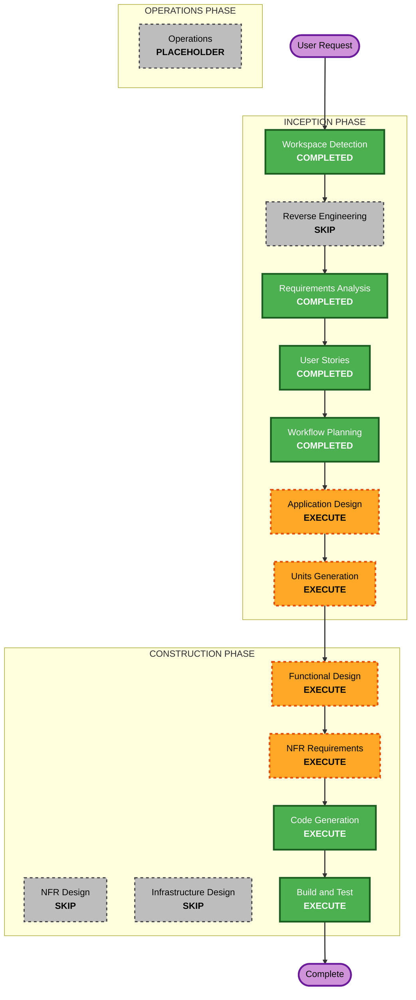

# 실행 계획

<!-- markdownlint-disable MD013 MD024 -->

## 상세 분석 요약

### 변경 영향 평가

- **User-facing changes**: Yes
  - Spotify 인증, 자연어 큐레이션 입력, 추천 결과 확인, 실제 playlist 생성
    흐름을 제공한다.
- **Structural changes**: Yes
  - Next.js App Router, Route Handler, domain service, Spotify API adapter,
    LLM provider port를 새로 구성한다.
- **Data model changes**: Yes
  - 영속 DB 스키마는 없지만 큐레이션 요청, Spotify track, 추천 결과,
    playlist 생성 결과의 TypeScript 타입이 필요하다.
- **API changes**: Yes
  - OAuth 시작과 callback, 큐레이션 실행, playlist 생성 Route Handler가
    필요하다.
- **NFR impact**: Yes
  - 테스트 가능성, secret 비노출, DB 없는 Vercel 배포, 외부 API 오류 처리가
    중요하다.

### MCP 결정

- Spotify MCP는 MVP에서 사용하지 않는다.
- 앱 런타임은 Next.js Route Handler에서 Spotify Web API를 직접 호출한다.
- fork한 MCP는 현재 build/test gate와 애플리케이션 의존성에 포함하지 않는다.

### 위험 평가

- **Risk Level**: Medium
- **Rollback Complexity**: Moderate
- **Testing Complexity**: Moderate
- **주요 위험**:
  - DB 없이 OAuth token과 세션을 처리하는 방식이 설계상 민감하다.
  - Spotify 실제 OAuth와 playlist 생성은 배포 URL과 developer dashboard 설정에
    영향을 받는다.
  - LLM provider는 MVP에서 placeholder 중심이므로 실제 추천 품질은 후속
    검증이 필요하다.

## Workflow Visualization

### Text Alternative

1. Workspace Detection: 완료
2. Reverse Engineering: 기존 코드가 없어 생략
3. Requirements Analysis: 완료
4. User Stories: 완료
5. Workflow Planning: 완료
6. Application Design: 실행
7. Units Generation: 실행
8. Functional Design: 실행
9. NFR Requirements: 실행
10. NFR Design: 생략
11. Infrastructure Design: 생략
12. Code Generation: 실행
13. Build and Test: 실행

## 실행할 단계

### INCEPTION PHASE

- [x] Workspace Detection
- [x] Reverse Engineering - SKIP
  - **Rationale**: 기존 애플리케이션 코드가 없다.
- [x] Requirements Analysis
- [x] User Stories
- [x] Workflow Planning
- [ ] Application Design - EXECUTE
  - **Rationale**: Next.js 앱 경계, Route Handler, domain service,
    Spotify API adapter, LLM interface, UI 상태 구성이 필요하다.
- [ ] Units Generation - EXECUTE
  - **Rationale**: 구현을 OAuth, 큐레이션 도메인, Spotify adapter,
    playlist 생성, UI, 검증 단위로 나누어 추적해야 한다.

### CONSTRUCTION PHASE

- [ ] Functional Design - EXECUTE
  - **Rationale**: 큐레이션 요청/응답 모델, playlist 생성 흐름, 대표 오류
    정책, adapter 계약을 상세화해야 한다.
- [ ] NFR Requirements - EXECUTE
  - **Rationale**: secret 비노출, DB 없는 Vercel 배포, 테스트 가능성,
    외부 API 오류 처리 요구가 있다.
- [ ] NFR Design - SKIP
  - **Rationale**: 별도 고급 NFR 패턴이나 복잡한 운영 설계는 MVP 범위 밖이다.
    필요한 NFR는 Functional Design과 Code Generation 제약으로 반영한다.
- [ ] Infrastructure Design - SKIP
  - **Rationale**: 별도 cloud resource나 IaC 없이 Vercel 배포와 환경 변수
    문서화로 충분하다.
- [ ] Code Generation - EXECUTE
  - **Rationale**: Next.js 프로젝트, 타입, Route Handler, UI, 테스트를
    생성해야 한다.
- [ ] Build and Test - EXECUTE
  - **Rationale**: build, unit/integration/e2e 검증과 요구사항 추적 증거가
    필요하다.

### OPERATIONS PHASE

- [ ] Operations - PLACEHOLDER
  - **Rationale**: 현재 AI-DLC에서 운영 단계는 placeholder다.

## 단위 분해 후보

| Unit | Scope | Related Stories | Notes |
| --- | --- | --- | --- |
| U-001 Project Foundation | Next.js, TypeScript, test setup, env docs | S-008 | DB 없음, Vercel 목표 |
| U-002 Spotify OAuth | OAuth start/callback, auth state | S-001, S-007 | secret 비노출 필요 |
| U-003 Spotify API Adapter | user data, tracks, playlist creation | S-003, S-006, S-007 | MCP 미사용 |
| U-004 Curation Domain | request model, candidate selection, LLM port | S-002, S-003, S-004 | 네트워크 없는 테스트 |
| U-005 User Experience | UI states, result display, create action | S-002, S-005, S-006, S-007 | 첫 화면이 실제 앱 |

## Requirement Verification Plan

| Requirement/Story | Acceptance Criteria or Contract | Required Test Evidence | Test Level | Planned Test File or Scenario | Required Result |
| --- | --- | --- | --- | --- | --- |
| R-001/S-001 | OAuth URL 생성과 callback 처리 | auth route 테스트 | unit/integration | `auth-routes.test.ts` | Pass |
| R-002/S-003 | Spotify 응답을 내부 모델로 변환 | adapter fixture 테스트 | unit/integration | `spotify-adapter.test.ts` | Pass |
| R-003/S-002/S-003 | 큐레이션 요청과 후보 생성 | domain service 테스트 | unit | `curation-service.test.ts` | Pass |
| R-004/S-004 | LLM provider port와 placeholder 응답 | port 계약 테스트 | unit | `llm-provider.test.ts` | Pass |
| R-005/S-005/S-006 | 추천 결과 표시와 playlist 생성 | UI 및 route 테스트 | unit/integration/e2e | `playlist-flow.spec.ts` | Pass |
| R-006/S-002/S-005 | 인증 전, 분석 중, 완료, 오류 UI | component/e2e 테스트 | unit/e2e | `app-states.test.tsx` | Pass |
| NFR-001/S-008 | 외부 API test double 가능 | mock adapter 기반 테스트 | unit/integration | shared test setup | Pass |
| NFR-002/S-008 | DB 없이 build 가능 | production build | build | `npm run build` | Pass |
| NFR-003/S-001/S-006/S-008 | secret client 노출 방지 | env boundary 테스트 | unit/integration | `env-boundary.test.ts` | Pass |
| NFR-004/S-008 | Vercel serverless 적합성 | build와 env 문서 확인 | build/manual | build-and-test summary | Pass |

## 예상 일정

- **Total Phases**: 6개 실행 단계
- **Estimated Duration**: 현재 세션 기준으로 설계 승인 후 구현까지 점진 진행
- **Execution Mode**: Design Track 유지

## 성공 기준

- **Primary Goal**: Spotify Web API 직접 호출 기반 Next.js MVP를 구현한다.
- **Key Deliverables**:
  - Next.js + TypeScript 프로젝트
  - Spotify OAuth Route Handler
  - Spotify API adapter
  - LLM provider port와 placeholder provider
  - 큐레이션 도메인 모델과 서비스
  - 사용자 화면과 주요 UI 상태
  - 단위, 통합, e2e 또는 대체 가능한 검증
- **Quality Gates**:
  - `npx markdownlint-cli2 "aidlc-docs/**/*.md"`
  - `npm run build`
  - 프로젝트 test 명령
  - 핵심 사용자 흐름의 브라우저 확인
- **Requirement Verification**: 위 Requirement Verification Plan의 각 항목이
  Code Generation과 Build and Test 결과로 추적되어야 한다.
